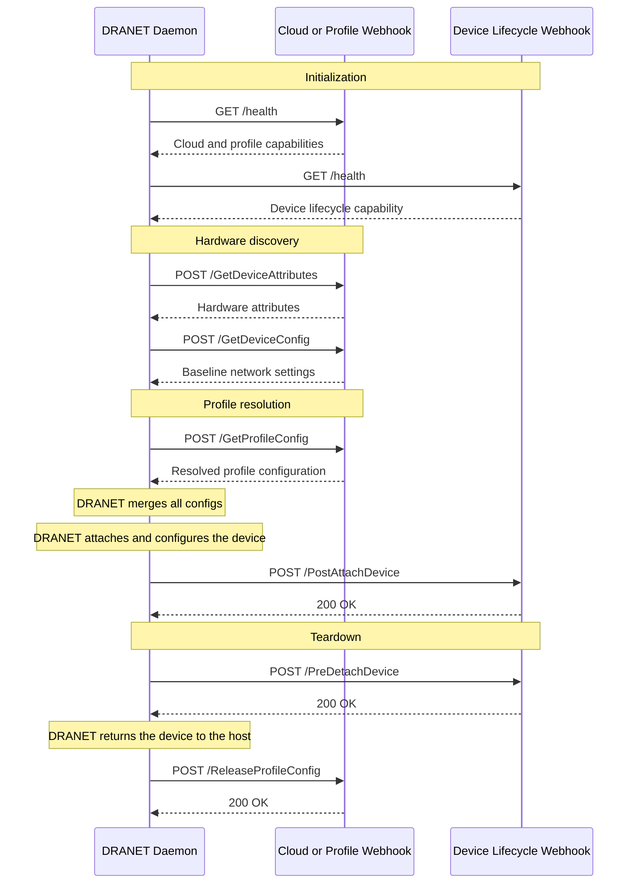

## Bring Your Own DRANET Provider (BYODP)

DRANET supports custom webhook implementations for hardware discovery (Cloud Provider), user intent (Profile Provider), and node-local device lifecycle handling (Device Lifecycle Provider).

Instead of hardcoding bare-metal or CNI logic directly into DRANET, you can delegate these responsibilities to an external server over HTTP, HTTPS, or a Unix domain socket.

### Enabling Webhook Providers

To enable the webhook provider, update the `dranet` daemonset arguments:

* **`--cloud-provider-hint=webhook`**: Delegates physical infrastructure data, such as MTU, MAC address, and VPC subnet data, to the webhook.
* **`--profile-provider=webhook`**: Delegates logical network assignments and IPAM to the webhook.
* **`--webhook-url=<url>`**: Sets the HTTP, HTTPS, or Unix socket URL used by cloud and profile webhook providers.
* **`--device-lifecycle-provider=webhook`**: Enables node-local post-attach and pre-detach callbacks.
* **`--device-lifecycle-webhook-url=<url>`**: Sets the independent HTTP, HTTPS, or Unix socket URL used by the device lifecycle webhook.
* **`--device-lifecycle-timeout=<duration>`**: Sets one timeout for each concurrent lifecycle callback batch. The default is `1s`.

The providers can be selected independently. For example, this configuration keeps native OKE hardware discovery, uses a profile webhook for IPAM, and uses a separate Unix socket provider for device lifecycle work:

```text
--cloud-provider-hint=OKE
--profile-provider=webhook
--webhook-url=http://127.0.0.1:18081
--device-lifecycle-provider=webhook
--device-lifecycle-webhook-url=unix:///var/run/dranet-lifecycle/provider.sock
--device-lifecycle-timeout=1s
```

The lifecycle URL is separate by design. It may point to the same server as `--webhook-url`, but it does not need to.

### Architecture Pipeline

The following diagram illustrates how DRANET communicates with the providers during discovery, profile resolution, and device attachment:



### How it Works in Practice

**1. Profile Providers (User Intent)**
Profile providers are options that third-party providers can expose to users to pick. The `profile` string in the DRANET configuration acts as a reference. It is suggested to follow a format that can be easily extended and clearly identified, such as `domain/name` (e.g. `acme.com/overlay`), or one with a clear meaning. In the `webhook-whereabouts` example, the `profile` string directly maps to the name of the underlying CNI configuration file.

**2. Cloud Providers (Cluster Provider Intent)**
Cloud providers are the authoritative source for the VM and its hardware, which is usually exposed via instance metadata. We offer two hooks for cloud providers: one to enhance the existing hardware metadata during discovery, and another to automate the provisioning of baseline hardware configurations. This represents the "cluster provider intent."

**3. Device Lifecycle Providers (Node Runtime Intent)**
Device lifecycle providers handle node-local work that can only happen after a device enters the Pod network namespace or immediately before it returns to the host. Examples include starting an authentication process or notifying a local device agent. These callbacks are bounded by a short timeout because they run in time-sensitive NRI hooks.

**4. Solid and Predictable Runtime Abstraction**
Cloud and profile providers still merge into a final, statically verifiable network configuration before runtime execution. The lifecycle provider is a narrow runtime extension. It receives the final pod-side configuration and device location, but it does not replace DRANET's interface programming.

### Webhook Capabilities Validation

To ensure safe delegation, DRANET requires the webhook server to declare its capabilities via the `/health` endpoint.

When DRANET connects to the webhook, it performs an HTTP `GET /health` and expects a JSON payload defining the supported capabilities:

```json
{
  "cloudProvider": false,
  "profileProvider": true,
  "deviceLifecycleProvider": false
}
```

If a selected provider reports that its capability is false, DRANET exits during initialization to prevent misconfiguration. For example, `--device-lifecycle-provider=webhook` requires `"deviceLifecycleProvider": true`.

### API Contracts

Your webhook server should implement the following HTTP `POST` endpoints based on the capabilities it provides. DRANET sends JSON payloads corresponding to its internal models.

#### Cloud Provider API (`cloudProvider: true`)

* `POST /GetDeviceAttributes`: Returns the physical hardware attributes for a device.
* `POST /GetDeviceConfig`: Returns the baseline physical network settings (like MTU).

#### Profile Provider API (`profileProvider: true`)

* `POST /GetProfileConfig`: Allocates and returns the logical profile configuration (e.g., allocating an IP address from IPAM).

  **Mutation & Validation**: The webhook receives the *entire* `NetworkConfig` (combined from user and cloud intents) as context. Unlike standard Mutating Webhooks on the API server, this node-level webhook cannot directly mutate the opaque config object in the API server. Instead, it computes and returns the *resolved profile parameters* (like the chosen IP), which DRANET then merges into the final configuration. Passing the full configuration gives the webhook the power of a Validating Admission Controller.

  **Denying Configurations**: The webhook can deny a configuration if the user's intent is invalid or conflicts with its rules. It communicates this by returning an appropriate HTTP error code. When a webhook returns a non-200 status code, DRANET aborts the network setup during the `NodePrepareResources` phase (before the pod sandbox is even created).

  **Handling Errors & HTTP Codes**:
  * **200 OK**: Request successful. Returns the allocated logical configuration.
  * **400 Bad Request**: The provided `NetworkConfig` is malformed or requests invalid parameters (e.g., requesting an IP outside the allowed subnet). The `NodePrepareResources` call will fail.
  * **404 Not Found**: The requested profile does not exist in the webhook provider.
  * **409 Conflict**: The request conflicts with current state (e.g., the statically requested IP is already in use).
  * **500 Internal Server Error**: The webhook failed to allocate resources. DRANET treats this as a temporary failure, and the kubelet will typically retry the `NodePrepareResources` call.
  * **Network Failures**: If DRANET cannot reach the webhook due to a network timeout or connection refused, it also fails the `NodePrepareResources` call, and kubelet will continually retry.

  **Trade-offs & Downsides (Node-level vs. API-level Validation)**:
  Because this validation happens at the *node level* during DRA `NodePrepareResources` (rather than at the API server via standard Admission Webhooks), there are important trade-offs to consider:
  * **Late Feedback**: If a configuration is invalid, the API server will still accept the Pod. The failure happens asynchronously when the pod is scheduled and the kubelet attempts to prepare resources. Users won't see an immediate error on `kubectl apply`; the pod will remain in a `Pending` state, and they must inspect Pod events to see the `NodePrepareResources` failure.
  * **Kubelet Retry Loops**: Standard Kubernetes behavior is to retry failed resource preparations. A persistent denial (like a 400 Bad Request) will cause the Kubelet to continuously retry `NodePrepareResources`, which can generate unnecessary load on the node and webhook server compared to an upfront API rejection.
  * **Idempotency**: The kubelet may retry `NodePrepareResources`, so DRANET can call this more than once for the same `(device, claimUID)`. It must return an equivalent result without allocating additional resources (e.g. key the allocation by `claimUID`, as `whereabouts` does via `CNI_CONTAINERID`).

* `POST /ReleaseProfileConfig`: Frees stateful resources (e.g., releasing an IP address). Also receives the full `NetworkConfig`. Should return `200 OK` on success or if the resource was already released (idempotency).
  * **Best-effort teardown**: A failed `ReleaseProfileConfig` is logged but not retried by DRANET (teardown must not block pod deletion). The provider therefore owns leak reclamation and must be able to garbage-collect orphaned allocations on its own, otherwise resources leak permanently.

#### Device Lifecycle API (`deviceLifecycleProvider: true`)

The device lifecycle provider is node-local because network namespace paths are valid only on the node where the Pod runs. Both endpoints receive the same JSON request:

```json
{
  "device": {
    "name": "rdma0",
    "mac_address": "00:11:22:33:44:55",
    "pci_address": "0000:0c:00.0"
  },
  "claim": {
    "namespace": "default",
    "name": "rdma-claim",
    "uid": "1df9fd4b-53c7-4cab-b6d4-bf0be5ee6526"
  },
  "pod": {
    "namespace": "default",
    "name": "worker-0",
    "uid": "fed8b82e-f193-4a52-83c2-b8b021763dc6"
  },
  "node_name": "worker-node-1",
  "network_namespace": "/var/run/netns/cni-1234",
  "host_interface_name": "rdma0",
  "pod_interface_name": "net1",
  "rdma_device_name": "mlx5_0",
  "config": {
    "interface": {
      "name": "net1",
      "addresses": [
        "192.0.2.10/24"
      ],
      "mtu": 9000
    }
  }
}
```

The fields have these meanings:

* `device` contains the locally discovered device identifiers.
* `claim` and `pod` contain stable Kubernetes object identity.
* `node_name` identifies the node that owns the namespace and device.
* `network_namespace` is the runtime-provided network namespace path. It can be empty or stale during teardown when the runtime has already removed the namespace.
* `host_interface_name` is the interface name before attachment.
* `pod_interface_name` is the final interface name inside the Pod namespace.
* `rdma_device_name` is the associated RDMA link device, if present.
* `config` is the final pod-side `NetworkConfig` after user, cloud, and profile configurations have been merged.

The interface name fields and `rdma_device_name` are optional. IB-only devices have no netdev, so their interface name fields are omitted. Lifecycle callbacks apply to them when `rdma_device_name` is present and DRANET uses exclusive RDMA namespace mode.

* `POST /PostAttachDevice`: Runs after DRANET attaches and configures the netdev and RDMA device. A timeout or non-200 response fails `RunPodSandbox`. A `200 OK` response confirms that the provider accepted the device. It does not mean that a longer operation, such as link authorization, has completed.
* `POST /PreDetachDevice`: Runs before DRANET attempts to return the RDMA device and netdev to the host. The runtime may already have removed the network namespace, so providers must also support cleanup by stable pod, claim, and device identity. Failures are logged, but teardown continues.

Both endpoints must be idempotent. NRI may repeat callbacks for the same Pod and device. DRANET also replays callbacks in these cases:

* `Synchronize` replays `PostAttachDevice` for live devices restored from DRANET state.
* `RemovePodSandbox` replays `PreDetachDevice` as a fallback when normal stop handling did not complete.

The provider must still reconcile its own state. Node crashes, forced process termination, and other failures can prevent a callback.

DRANET sends callbacks for all devices in a hook concurrently under one timeout. Increasing the timeout delays the time-sensitive NRI hook for the whole Pod.

Kernel device moves and persistent state updates are not atomic. A crash in the short interval between them can cause a missed replay or an extra idempotent replay. The provider must use stable request identities and reconcile its desired state.

##### Persistent replay state

Replay across DRANET DaemonSet Pod replacement requires a persistent DRANET database. The binary defaults to `/var/run/dranet/dranet.db`, but the chart does not host-mount that directory by default. Use `extraVolumeMounts` and `extraVolumes` to place it on the node:

```yaml
extraVolumeMounts:
  - name: dranet-state
    mountPath: /var/run/dranet

extraVolumes:
  - name: dranet-state
    hostPath:
      path: /var/lib/dranet
      type: DirectoryOrCreate
```

Without this mount, stored device state is ephemeral and lifecycle replay after a DRANET container or Pod replacement is not available.

##### Node-local deployment

For a Unix socket, mount the socket's parent directory into both DRANET and the provider. Mounting the directory avoids requiring the socket file to exist before either DaemonSet starts.

For HTTP, run the provider on every node with `hostNetwork: true` and use a loopback URL such as `http://127.0.0.1:18080`. Do not use a normal Kubernetes Service that may send the request to another node.

If the provider enters `network_namespace`, it must resolve the path in its own mount and PID namespace. Mount the same `/var/run/netns` host directory when the runtime uses that path, or provide equivalent host namespace access.

### Reference Implementation

An example implementation of a webhook profile provider that wraps the standard CNI `whereabouts` IPAM plugin is available at `cmd/webhook-whereabouts`. It acts as an independent module.

You can run this reference webhook locally:
```bash
cd cmd/webhook-whereabouts
go build .
./webhook-whereabouts --bind-address=127.0.0.1:8080
```
